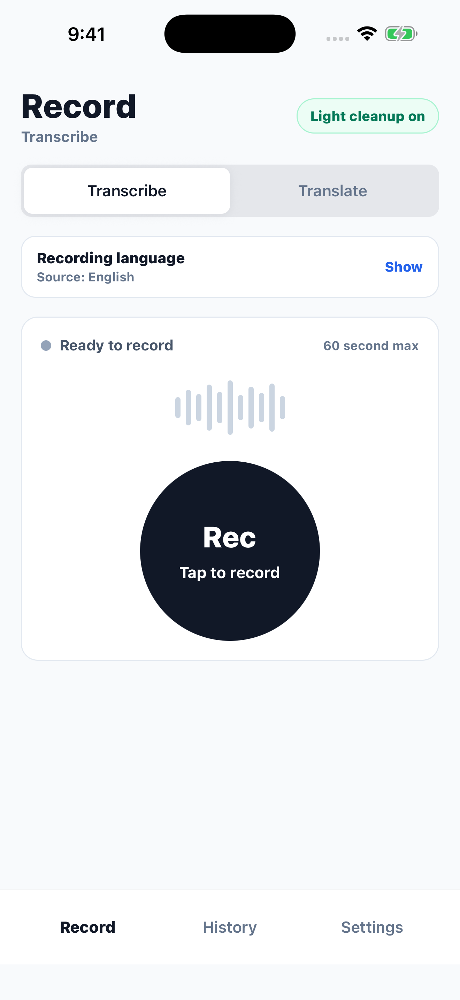

# SayCopy

SayCopy is a privacy-conscious iOS app for recording, transcribing, translating, organizing, and copying spoken text. It is built with Expo and React Native and uses a user-supplied OpenRouter API key.

[Website](https://saycopy.app) · [Setup guide](https://saycopy.app/setup) · [Support](https://saycopy.app/support) · [Security policy](SECURITY.md)



## What it does

- Records audio with explicit start, pause, resume, cancel, and finish controls.
- Transcribes recordings through OpenRouter-compatible models.
- Translates transcripts into a selected target language.
- Stores history, tags, and preferences locally with SQLite.
- Stores the user's OpenRouter token with Expo SecureStore.
- Copies results to the system clipboard without embedding a shared service credential.

## Privacy model

SayCopy does not ship with a shared OpenRouter key. Users provide their own key, which is stored in the platform secure store. Audio is sent to OpenRouter only when a user starts a transcription or translation flow. Temporary audio cleanup is best-effort after processing, and saved text remains in the local application database.

Review the public [privacy page](https://saycopy.app/privacy) and the source before using the app with sensitive material. Never include real API keys, recordings, transcripts, or personal data in issues or pull requests.

## Development

### Requirements

- Node.js 20.19.4 or a compatible newer release
- npm 10
- Xcode and an iOS Simulator for native development
- Expo tooling invoked through the project scripts

### Get started

```sh
git clone https://github.com/altitudeinfosys/saycopy.git
cd saycopy
npm ci
npm run ios
```

The GitHub repository is expected to be renamed to `altitudeinfosys/saycopy` before it becomes public. Until that rename is complete, use the current private remote supplied by the maintainer.

### Quality checks

```sh
npm test
npm run typecheck
npm run lint
npm run doctor
node --check website/api/contact.js
```

CI runs the same checks for pull requests and pushes to `main`.

## Project structure

- `src/` — application, domain, provider, storage, and UI code
- `website/` — the static website and Vercel contact function
- `assets/` — application artwork
- `docs/` — product, release, testing, and project records
- `.github/` — CI, Dependabot, and contribution templates

Some stable Expo, EAS, bundle, and package identifiers retain the project's earlier internal name. Changing identifiers used by an already-released mobile app can break updates, so they are not repository-renaming targets.

## Contributing

Read [CONTRIBUTING.md](CONTRIBUTING.md) and the [Code of Conduct](CODE_OF_CONDUCT.md) before opening a pull request. Report suspected vulnerabilities privately according to [SECURITY.md](SECURITY.md).

## License and trademarks

Source code is licensed under the [Apache License 2.0](LICENSE).

The SayCopy name, logos, icons, screenshots, and other brand assets are not licensed under Apache-2.0. See [TRADEMARKS.md](TRADEMARKS.md) and [NOTICE](NOTICE) before distributing a fork or using SayCopy branding.
